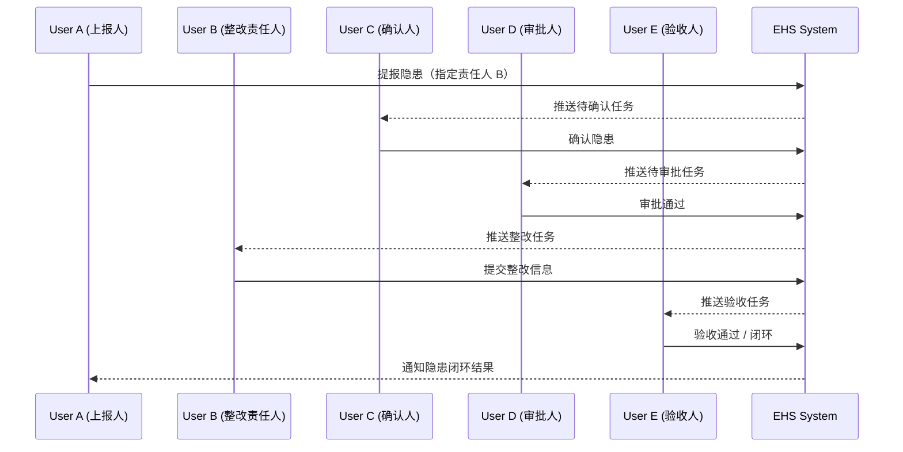

# 隐患处理核心链路

本文件用于梳理隐患从上报到闭环的核心业务链路，并明确每一步的状态（Status）与当前处理人（Current Assignee）变化，便于统一业务理解与测试基线。

## 核心步骤说明

1. 新建（Report）
   - 触发人：用户 A
   - 动作：上报隐患并指定整改责任人 B
   - 结果：流程进入确认阶段，当前处理人指向用户 C

2. 确认（Confirm）
   - 触发人：用户 C
   - 动作：确认隐患信息
   - 结果：流程进入审批阶段，当前处理人指向用户 D

3. 审批（Approve）
   - 触发人：用户 D
   - 动作：审批通过
   - 结果：流程进入整改阶段，当前处理人回到责任人 B

4. 整改（Rectify）
   - 触发人：用户 B
   - 动作：提交整改结果（包含整改描述与附件）
   - 结果：流程进入验收阶段，当前处理人指向用户 E

5. 验收（Accept/Close）
   - 触发人：用户 E
   - 动作：验收通过并闭环
   - 结果：流程关闭，隐患状态为 closed

## 状态与处理人变化

| 步骤 | 触发人 | 期望状态（Status） | 当前处理人（Current Assignee） |
| --- | --- | --- | --- |
| 新建（Report） | User A | assigned | User C |
| 确认（Confirm） | User C | assigned | User D |
| 审批（Approve） | User D | rectifying | User B |
| 整改（Rectify） | User B | verified | User E |
| 验收（Accept/Close） | User E | closed | 无（或保持为 User E，视闭环策略而定） |

> 说明：系统的标准状态为 `reported / assigned / rectifying / verified / closed`。当确认/审批作为自定义步骤插入时，状态仍会沿用 `assigned`，直至进入整改步骤后切换为 `rectifying`。

## Mermaid 时序图

