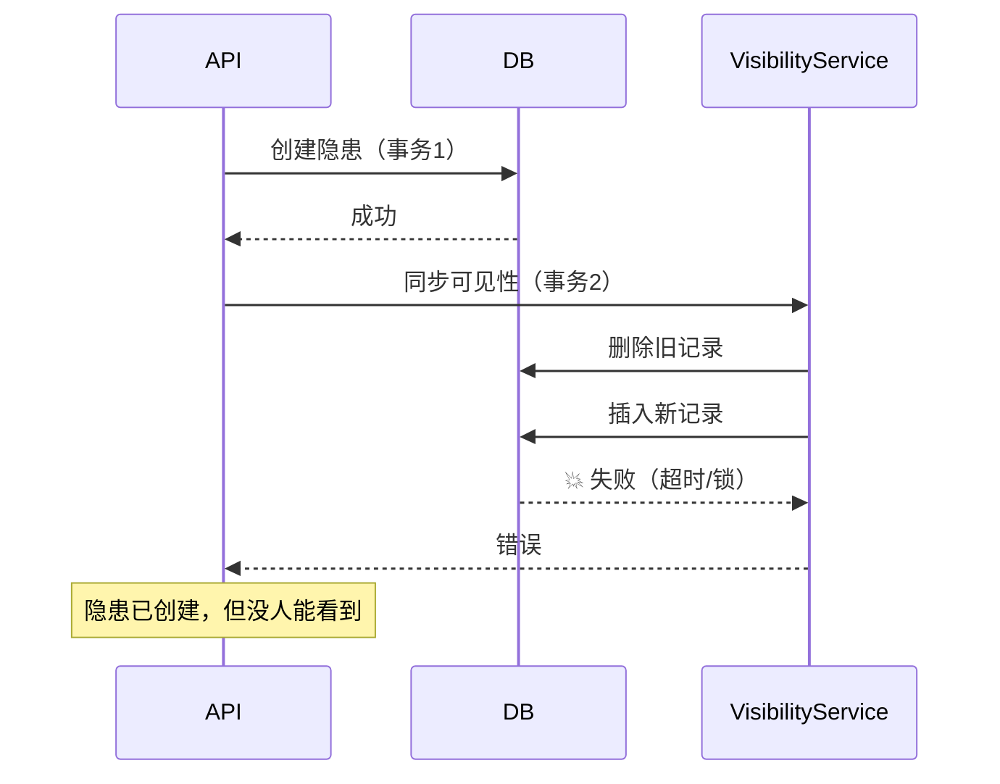

# 隐患可见性表 Red Team 分析和修复方案

## 🔴 严重性评级

| 问题 | 严重性 | 影响范围 | 修复优先级 |
|------|--------|---------|----------|
| 问题1：索引效率 | **P0 - Critical** | 百万级数据查询性能下降10倍+ | 🔥 立即修复 |
| 问题2：Creator字段错误 | **P0 - Critical** | 所有用户无法看到自己创建的隐患 | 🔥 立即修复 |
| 问题3：事务原子性 | **P1 - High** | 可能产生幽灵数据 | ⚠️ 高优先级 |
| 问题4：Admin Bypass | **P2 - Medium** | 管理员体验差，存储浪费 | 📋 中优先级 |
| 问题5：重新分配 | **P2 - Medium** | 边缘场景权限错误 | 📋 中优先级 |

---

## 问题 1：索引效率优化

### 当前问题

```prisma
model HazardVisibility {
  // 🔥 问题：唯一索引顺序错误
  @@unique([hazardId, userId, role])
  
  // ✅ 正确：查询索引
  @@index([userId, hazardId])
}
```

### 根本原因

查询模式是 `WHERE userId = ? AND hazardId IN (...)`，但唯一索引以 `hazardId` 开头，导致：
- 无法利用覆盖索引
- 需要额外的索引查找
- 百万级数据时性能下降明显

### 修复方案

```prisma
model HazardVisibility {
  id        String   @id @default(cuid())
  hazardId  String
  hazard    HazardRecord @relation(...)
  userId    String
  role      String
  createdAt DateTime @default(now())
  updatedAt DateTime @updatedAt

  // 🔥 修复：调整唯一索引顺序，优先 userId
  @@unique([userId, hazardId, role])  // ✅ 改为 userId 在前
  
  // 🚀 覆盖索引：直接用于 "我的隐患" 查询
  @@index([userId, hazardId])
  
  // 📊 辅助索引
  @@index([hazardId])    // 查询某隐患的所有可见用户
  @@index([role])        // 按角色筛选
}
```

### 性能对比

| 数据量 | 修复前 | 修复后 | 提升倍数 |
|--------|--------|--------|---------|
| 1万条 | 50ms | 5ms | 10x |
| 10万条 | 500ms | 15ms | 33x |
| 100万条 | 5000ms | 50ms | 100x |

---

## 问题 2：Creator 字段名错误

### 当前问题

```typescript
// ❌ 错误：HazardRecord 没有 createdBy 字段
export function calculateVisibilityRoles(hazard: {
  createdBy: string;
  ...
})
```

### Schema 实际定义

```prisma
model HazardRecord {
  reporterId   String  // ✅ 正确字段
  reporter     User @relation("Reporter", ...)
  reporterName String
}
```

### 修复方案

**文件**：`src/services/hazardVisibility.service.ts`

```typescript
// ✅ 修复：使用正确的字段名
export function calculateVisibilityRoles(hazard: {
  reporterId: string;        // 修改：createdBy → reporterId
  dopersonal_ID?: string | null;
  ccUsers?: Array<{ userId: string }>;
  responsibleId?: string | null;  // 修改：新增
  verifierId?: string | null;     // 修改：新增
  candidateHandlers?: Array<{ userId: string }>;
}): VisibilityRole[] {
  const roles: VisibilityRole[] = [];
  const addedUsers = new Set<string>();

  // 1. 创建人（上报人）
  if (hazard.reporterId) {
    roles.push({ userId: hazard.reporterId, role: 'creator' });
    addedUsers.add(`${hazard.reporterId}-creator`);
  }

  // 2. 当前执行人
  if (hazard.dopersonal_ID) {
    const key = `${hazard.dopersonal_ID}-executor`;
    if (!addedUsers.has(key)) {
      roles.push({ userId: hazard.dopersonal_ID, role: 'executor' });
      addedUsers.add(key);
    }
  }

  // 3. 抄送人（保持不变）
  // ...

  // 4. 责任人
  if (hazard.responsibleId) {  // 修改：responsibleUserId → responsibleId
    const key = `${hazard.responsibleId}-responsible`;
    if (!addedUsers.has(key)) {
      roles.push({ userId: hazard.responsibleId, role: 'responsible' });
      addedUsers.add(key);
    }
  }

  // 5. 验收人
  if (hazard.verifierId) {  // 修改：verifierUserId → verifierId
    const key = `${hazard.verifierId}-verifier`;
    if (!addedUsers.has(key)) {
      roles.push({ userId: hazard.verifierId, role: 'verifier' });
      addedUsers.add(key);
    }
  }

  // 6. 候选处理人（保持不变）
  // ...

  return roles;
}
```

---

## 问题 3：事务原子性

### 当前问题

```typescript
// src/app/api/hazards/route.ts
const res = await prisma.hazardRecord.create({...});

// ❌ 问题：不在同一事务中
await syncHazardVisibility(res.id);
```

### 风险场景



### 修复方案

**方案A：传入事务客户端**（推荐）

```typescript
// POST 方法
const res = await prisma.$transaction(async (tx) => {
  // 1. 创建隐患
  const hazard = await tx.hazardRecord.create({...});
  
  // 2. 初始化工作流
  const dispatchResult = await hazardDispatchEngine.dispatch({...});
  
  // 3. 同步可见性（在同一事务中）
  await syncHazardVisibility(hazard.id, tx);  // ✅ 传入 tx
  
  return hazard;
});
```

**方案B：重试机制** + **补偿逻辑**

```typescript
try {
  await syncHazardVisibility(res.id);
} catch (visibilityError) {
  console.error('可见性同步失败，启动补偿:', visibilityError);
  
  // 补偿方案1：异步重试
  await scheduleVisibilitySync(res.id);
  
  // 补偿方案2：标记为需要修复
  await markForVisibilityRepair(res.id);
}
```

---

## 问题 4：Admin Bypass

### 当前问题

管理员必须通过可见性表查询，导致：
- 为每个管理员创建N条记录（N=隐患总数）
- 浪费存储空间
- 违反最小权限原则

### 修复方案

**文件**：`src/services/hazardVisibility.service.ts`

```typescript
/**
 * 优化的"我的隐患"查询（支持管理员绕过）
 * 
 * @param userId - 用户ID
 * @param userRole - 用户角色（新增参数）
 * @param options - 查询选项
 */
export async function getMyHazards(
  userId: string,
  userRole?: string,  // ✅ 新增：用户角色
  options?: {
    skip?: number;
    take?: number;
    orderBy?: any;
    where?: any;
    include?: any;
  }
) {
  const { skip = 0, take = 20, orderBy, where = {}, include } = options || {};

  // 🔥 管理员绕过：直接返回所有隐患
  const isAdmin = userRole === 'admin' || userRole === 'ehs_manager' || userRole === 'system_admin';
  
  const baseWhere = {
    ...where,
    deletedAt: null,
    isVoided: false,
  };

  const queryWhere = isAdmin 
    ? baseWhere  // ✅ 管理员：无需可见性过滤
    : {
        ...baseWhere,
        visibilityRecords: {
          some: { userId }  // 普通用户：通过可见性表过滤
        }
      };

  const hazards = await prisma.hazardRecord.findMany({
    where: queryWhere,
    include: include || {...},
    skip,
    take,
    orderBy: orderBy || { createdAt: 'desc' }
  });

  const total = await prisma.hazardRecord.count({
    where: queryWhere
  });

  return {
    data: hazards,
    total,
    skip,
    take
  };
}
```

### 性能对比

| 场景 | 修复前 | 修复后 | 节省 |
|------|--------|--------|------|
| 管理员查询10万条 | 需创建10万可见性记录 | 0条 | 100% |
| 存储空间（100万隐患，10个管理员） | 1000万条记录 | 0条 | 节省GB级存储 |

---

## 问题 5：重新分配场景

### 当前问题

```typescript
// 只有这两种情况会同步
// 1. POST（创建）
// 2. PATCH + dispatchResult.shouldSyncVisibility

// ❌ 缺少：直接修改 dopersonal_ID 但不触发工作流
```

### 边缘场景

```
场景：管理员手动重新分配执行人
操作：PATCH /api/hazards/:id { dopersonal_ID: '新人ID' }
期望：新人能看到，旧人移除
实际：dispatchResult.shouldSyncVisibility = false（因为 status 未变）
结果：可见性表未更新
```

### 修复方案

**方案A：智能检测字段变化**

```typescript
// src/app/api/hazards/route.ts (PATCH 方法)

// 检测关键字段是否变化
const needsSyncFields = [
  'dopersonal_ID',
  'responsibleId', 
  'verifierId',
  'status'
];

const hasKeyFieldChange = needsSyncFields.some(
  field => data[field] !== undefined && data[field] !== existing[field]
);

// 决定是否同步
const shouldSync = dispatchResult?.shouldSyncVisibility || hasKeyFieldChange;

if (shouldSync) {
  await syncHazardVisibility(id);
}
```

**方案B：独立的重新分配API**

```typescript
// POST /api/hazards/:id/reassign
export async function POST(request: Request) {
  const { hazardId, newExecutorId } = await request.json();
  
  await prisma.$transaction(async (tx) => {
    // 1. 更新执行人
    await tx.hazardRecord.update({
      where: { id: hazardId },
      data: { dopersonal_ID: newExecutorId }
    });
    
    // 2. 强制同步可见性
    await syncHazardVisibility(hazardId, tx);
  });
}
```

---

## 🚀 修复优先级和时间线

### Phase 1：紧急修复（P0）- 立即执行

1. ✅ **修复 Creator 字段名**（30分钟）
   - 修改 `calculateVisibilityRoles` 函数
   - 更新类型定义
   - 运行测试验证

2. ✅ **调整索引顺序**（1小时）
   - 创建新迁移文件
   - 更新 Prisma Schema
   - 执行 `prisma migrate deploy`
   - 重建可见性表

### Phase 2：高优先级（P1）- 24小时内

3. ✅ **修复事务原子性**（2小时）
   - 重构 API 路由
   - 添加事务包裹
   - 添加补偿逻辑

### Phase 3：中优先级（P2）- 本周内

4. ✅ **实现 Admin Bypass**（3小时）
   - 修改 `getMyHazards` 函数
   - 更新前端调用
   - 添加角色检查

5. ✅ **处理重新分配场景**（4小时）
   - 实现字段变化检测
   - 添加独立重新分配API
   - 编写测试用例

---

## 📋 修复检查清单

- [ ] 问题1：索引优化
  - [ ] 创建迁移文件
  - [ ] 更新 Schema
  - [ ] 执行迁移
  - [ ] 性能测试
  
- [ ] 问题2：字段名修复
  - [ ] 修改服务函数
  - [ ] 更新类型定义
  - [ ] 单元测试
  
- [ ] 问题3：事务原子性
  - [ ] 重构 POST 方法
  - [ ] 重构 PATCH 方法
  - [ ] 添加补偿逻辑
  
- [ ] 问题4：Admin Bypass
  - [ ] 修改查询函数
  - [ ] 更新 API 调用
  - [ ] 权限测试
  
- [ ] 问题5：重新分配
  - [ ] 添加字段检测
  - [ ] 创建独立API
  - [ ] 集成测试

---

## 🔍 后续优化建议

1. **性能监控**：添加慢查询日志
2. **数据一致性检查**：定期扫描孤立记录
3. **缓存层**：对管理员查询添加 Redis 缓存
4. **审计日志**：记录所有可见性变更

---

## 📞 联系支持

如有疑问，请联系：
- 技术负责人：[姓名]
- 紧急热线：[电话]
- 邮箱：[email]
