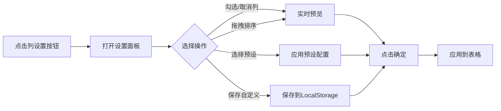
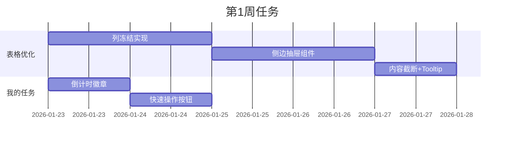

# EHS隐患排查管理系统 - 表格UI/UX优化设计方案

> **设计师**: 高级前端架构师 & UI/UX设计师  
> **项目**: EHS隐患排查管理系统  
> **日期**: 2026-01-22  
> **版本**: v2.0

---

## 📋 目录

1. [设计目标与痛点分析](#1-设计目标与痛点分析)
2. [页面A：全部隐患查询优化方案](#2-页面a全部隐患查询优化方案)
3. [页面B：我的任务优化方案](#3-页面b我的任务优化方案)
4. [通用UI组件设计](#4-通用ui组件设计)
5. [视觉设计规范](#5-视觉设计规范)
6. [交互细节说明](#6-交互细节说明)
7. [实施优先级与路线图](#7-实施优先级与路线图)

---

## 1. 设计目标与痛点分析

### 1.1 当前痛点

**现状分析（基于代码审查）**：
- ✅ **已有优势**：表格已实现斑马纹、悬停高效、作废标识、响应式卡片视图
- ❌ **核心问题**：
  1. **字段过多**：表格包含13列（隐患编号、状态、风险等级、类型、位置、描述、责任部门、责任人、期限、整改描述、整改时间、整改措施、操作），超出最佳实践的7±2列原则
  2. **缺少列冻结**：用户横向滚动时容易迷失上下文
  3. **无侧边抽屉**：点击查看需打开模态框，缺少流畅的"快速预览"体验
  4. **列不可配置**：无法根据角色/场景自定义展示列
  5. **筛选栏占用空间大**：当前实现未知，但B端系统常见问题

### 1.2 设计目标

| 维度 | 目标 | 成功指标 |
|------|------|----------|
| **信息密度** | 减少30%的横向滚动 | 核心信息在首屏可见 |
| **操作效率** | 点击→查看详情≤0.5秒 | 侧边抽屉替代模态框 |
| **可定制性** | 支持5种预设视图 | 用户可保存个人列配置 |
| **移动友好** | 卡片视图优化 | 手机端100%可用 |

---

## 2. 页面A：全部隐患查询优化方案

### 2.1 表格列定义优化

#### 2.1.1 推荐核心列（5-7列）

**方案A：管理视角（默认）**
```
┌─────────┬────────┬──────────┬──────────┬──────────────┬──────────┬────────┐
│ 隐患编号 │ 状态   │ 风险等级 │ 位置+部门│ 隐患描述     │ 截止日期 │ 操作   │
│ (冻结)  │        │          │ (复合列) │ (截断)       │ (倒计时) │ (冻结) │
└─────────┴────────┴──────────┴──────────┴──────────────┴──────────┴────────┘
```

**方案B：整改执行视角**
```
┌─────────┬────────┬──────────┬──────────┬──────────┬──────────┬────────┐
│ 隐患编号 │ 状态   │ 风险等级 │ 责任人   │ 截止日期 │ 整改进度 │ 操作   │
│ (冻结)  │        │          │          │ (倒计时) │ (百分比) │ (冻结) │
└─────────┴────────┴──────────┴──────────┴──────────┴──────────┴────────┘
```

#### 2.1.2 复合列设计

**"位置+部门"复合列示例**：
```tsx
// 视觉布局
┌────────────────────┐
│ 📍 车间A-3号生产线 │  ← 位置（主标题，粗体）
│ 🏢 生产部         │  ← 部门（副标题，灰色小字）
└────────────────────┘
```

**实现代码片段**：
```tsx
<td className="p-3 align-top">
  <div className="space-y-0.5">
    <div className="text-sm font-medium text-slate-800 flex items-center gap-1">
      <MapPin size={12} className="text-slate-400" />
      {h.location}
    </div>
    {h.responsibleDeptName && (
      <div className="text-xs text-slate-500 flex items-center gap-1 pl-4">
        <Building2 size={10} className="text-slate-400" />
        {h.responsibleDeptName}
      </div>
    )}
  </div>
</td>
```

#### 2.1.3 列优先级分级

| 优先级 | 列名 | 始终显示 | 可选显示 | 移除候选 |
|--------|------|----------|----------|----------|
| P0 | 隐患编号 | ✅ | - | - |
| P0 | 状态 | ✅ | - | - |
| P0 | 风险等级 | ✅ | - | - |
| P0 | 操作 | ✅ | - | - |
| P1 | 隐患描述 | ✅ | - | - |
| P1 | 截止日期 | ✅ | - | - |
| P2 | 位置+部门 | - | ✅ | - |
| P2 | 责任人 | - | ✅ | - |
| P3 | 检查类型 | - | - | ✅ |
| P3 | 整改描述 | - | - | ✅ |
| P3 | 整改措施 | - | - | ✅ |

### 2.2 筛选区布局设计

#### 2.2.1 折叠式筛选栏（推荐）

**展开状态（垂直占用：120px）**：
```
┌─────────────────────────────────────────────────────────────┐
│ 🔍 筛选条件                                    [收起 ▲]      │
├─────────────────────────────────────────────────────────────┤
│ 状态: [全部 ▼]  风险: [全部 ▼]  部门: [全部 ▼]  关键词: [ ] │
│ 日期: [最近30天 ▼]           [重置]  [搜索]                  │
└─────────────────────────────────────────────────────────────┘
```

**收起状态（垂直占用：48px）**：
```
┌─────────────────────────────────────────────────────────────┐
│ 🔍 快速筛选: [状态 ▼] [风险 ▼] [关键词搜索...]   [展开 ▼]   │
└─────────────────────────────────────────────────────────────┘
```

#### 2.2.2 侧边筛选面板（备选方案）

适合超过10个筛选条件的场景，参考Ant Design Pro的做法：

```
┌──────────┬─────────────────────────────────┐
│ 筛选面板 │         表格内容区              │
│ (280px)  │                                 │
│ ┌──────┐ │ ┌────────┬──────┬────────┐     │
│ │状态  │ │ │隐患编号│ 状态 │ ...    │     │
│ │□待整改│ │ └────────┴──────┴────────┘     │
│ │□已整改│ │                                 │
│ └──────┘ │                                 │
│ ┌──────┐ │                                 │
│ │风险  │ │                                 │
│ └──────┘ │                                 │
└──────────┴─────────────────────────────────┘
```

### 2.3 列设置（自定义视图）

#### 2.3.1 列设置弹出框UI

```
┌────────────────────────────────────┐
│ 自定义表格列              [× 关闭] │
├────────────────────────────────────┤
│ 📌 固定列（不可隐藏）              │
│  ☑ 隐患编号                        │
│  ☑ 状态                            │
│  ☑ 操作                            │
├────────────────────────────────────┤
│ 🔧 可选列（拖拽调整顺序）          │
│  ☑ ≡ 风险等级                      │
│  ☑ ≡ 隐患描述                      │
│  ☐ ≡ 检查类型                      │
│  ☐ ≡ 整改方式                      │
│  ☑ ≡ 位置+部门                     │
│  ☑ ≡ 责任人                        │
│  ☑ ≡ 截止日期                      │
│  ☐ ≡ 整改描述                      │
├────────────────────────────────────┤
│ 💾 预设视图                        │
│  ○ 默认视图                        │
│  ○ 管理视角                        │
│  ○ 执行视角                        │
│  ● 我的自定义 [保存] [重命名]      │
├────────────────────────────────────┤
│          [恢复默认]     [确定]     │
└────────────────────────────────────┘
```

#### 2.3.2 列设置交互流程



### 2.4 侧边抽屉详情设计

#### 2.4.1 抽屉触发方式

1. **点击隐患编号** → 打开抽屉
2. **点击行** → 打开抽屉（当前是模态框）
3. **点击"查看"按钮**（新增）→ 打开抽屉

#### 2.4.2 抽屉布局结构（宽度：600px）

```
┌──────────────────────────────────────────┐
│ ← 返回  隐患详情 #HD20260122001  [× 关闭]│
├──────────────────────────────────────────┤
│ 📋 基本信息                    [编辑]     │
│ ┌────────────────────────────────────┐   │
│ │ 状态: [待整改]  风险: [高风险]     │   │
│ │ 类型: 设备故障  位置: 车间A-3号线  │   │
│ │ 责任部门: 生产部  责任人: 张三     │   │
│ └────────────────────────────────────┘   │
│                                           │
│ 📝 隐患描述                               │
│ ┌────────────────────────────────────┐   │
│ │ 3号生产线电机轴承温度过高...       │   │
│ └────────────────────────────────────┘   │
│                                           │
│ 📸 现场照片 (3张)                [查看全部]│
│ ┌───┬───┬───┐                           │
│ │ ▪ │ ▪ │ ▪ │                           │
│ └───┴───┴───┘                           │
│                                           │
│ 🔧 整改信息                               │
│ ┌────────────────────────────────────┐   │
│ │ 截止日期: 2026-01-30 (剩余8天)     │   │
│ │ 整改措施: 更换轴承，加强巡检...    │   │
│ └────────────────────────────────────┘   │
│                                           │
│ ⏱️ 处理记录 (时间轴)                      │
│ ┌────────────────────────────────────┐   │
│ │ ● 2026-01-22 10:30  张三 上报      │   │
│ │ │ 上报人: 李四                       │   │
│ │ ● 2026-01-22 14:00  系统自动分配   │   │
│ │   责任人: 张三                        │   │
│ └────────────────────────────────────┘   │
│                                           │
│         [去整改] [申请延期] [导出PDF]     │
└──────────────────────────────────────────┘
```

#### 2.4.3 抽屉vs模态框对比

| 特性 | 模态框 | 侧边抽屉 | 推荐 |
|------|--------|----------|------|
| 页面覆盖 | 100% | 局部 | ✅ 抽屉 |
| 保持上下文 | ❌ | ✅ | ✅ 抽屉 |
| 快速切换 | ❌ | ✅（上/下箭头）| ✅ 抽屉 |
| 适合长内容 | 一般 | ✅ | ✅ 抽屉 |
| 移动端适配 | 好 | 一般 | ⚖️ 平手 |

### 2.5 内容截断与Tooltip

#### 2.5.1 截断规则

| 列名 | 最大字符数 | 截断方式 | Tooltip |
|------|-----------|---------|---------|
| 隐患描述 | 30字符 | `line-clamp-2` | ✅ 完整内容 |
| 整改描述 | 30字符 | `line-clamp-2` | ✅ 完整内容 |
| 位置 | 20字符 | `truncate` | ✅ 完整内容 |
| 部门名称 | 15字符 | `truncate` | ✅ 完整内容 |

#### 2.5.2 Tooltip实现示例

```tsx
import { Tooltip, TooltipContent, TooltipProvider, TooltipTrigger } from '@/components/ui/tooltip';

<TooltipProvider delayDuration={300}>
  <Tooltip>
    <TooltipTrigger asChild>
      <div className="text-sm line-clamp-2 cursor-help">
        {h.desc}
      </div>
    </TooltipTrigger>
    <TooltipContent side="top" className="max-w-md">
      <p className="text-sm">{h.desc}</p>
    </TooltipContent>
  </Tooltip>
</TooltipProvider>
```

---

## 3. 页面B：我的任务优化方案

### 3.1 差异化设计要点

#### 3.1.1 核心差异

| 维度 | 全部隐患查询 | 我的任务 |
|------|-------------|---------|
| **用户目标** | 检索、分析、导出 | **快速处理、避免遗漏** |
| **信息重点** | 全局趋势、分布 | **个人待办、截止倒计时** |
| **操作重点** | 查看、筛选 | **去整改、验收、延期** |
| **视觉风格** | 中性、信息密集 | **紧迫感、行动导向** |

#### 3.1.2 推荐核心列（6列）

```
┌─────────┬────────┬──────────┬──────────────┬──────────────┬────────────┐
│ 隐患编号 │ 紧急度 │ 任务类型 │ 隐患描述     │ 截止倒计时   │ 快速操作   │
│ (冻结)  │ (徽章) │ (徽章)   │ (截断)       │ (动态颜色)   │ (固定)     │
└─────────┴────────┴──────────┴──────────────┴──────────────┴────────────┘
```

**新增列说明**：
- **紧急度**：基于截止日期计算（红色=今天到期，黄色=3天内，绿色=7天以上）
- **任务类型**：待整改、待验收、待审批（替换原"状态"列，更面向动作）
- **快速操作**：大按钮替代图标（"去整改"、"验收"、"延期"）

### 3.2 截止倒计时设计

#### 3.2.1 倒计时徽章样式

```tsx
// 视觉效果
┌──────────────┐
│ 🔴 今天到期  │  ← 红色，闪烁动画
└──────────────┘

┌──────────────┐
│ 🟡 剩余3天   │  ← 黄色
└──────────────┘

┌──────────────┐
│ 🟢 剩余10天  │  ← 绿色
└──────────────┘

┌──────────────┐
│ ⚫ 已逾期2天 │  ← 灰色，删除线
└──────────────┘
```

#### 3.2.2 实现代码

```tsx
const getDeadlineStatus = (deadline: string) => {
  const today = new Date();
  const dueDate = new Date(deadline);
  const diffDays = Math.ceil((dueDate.getTime() - today.getTime()) / (1000 * 60 * 60 * 24));
  
  if (diffDays < 0) {
    return { 
      label: `已逾期${Math.abs(diffDays)}天`, 
      color: 'bg-gray-500 text-white',
      icon: '⚫',
      animate: false 
    };
  } else if (diffDays === 0) {
    return { 
      label: '今天到期', 
      color: 'bg-red-500 text-white',
      icon: '🔴',
      animate: true // 闪烁动画
    };
  } else if (diffDays <= 3) {
    return { 
      label: `剩余${diffDays}天`, 
      color: 'bg-yellow-500 text-white',
      icon: '🟡',
      animate: false 
    };
  } else {
    return { 
      label: `剩余${diffDays}天`, 
      color: 'bg-green-500 text-white',
      icon: '🟢',
      animate: false 
    };
  }
};

// 使用
const deadlineStatus = getDeadlineStatus(h.deadline);
<div className={cn(
  "inline-flex items-center gap-1 px-2 py-1 rounded-full text-xs font-semibold",
  deadlineStatus.color,
  deadlineStatus.animate && "animate-pulse"
)}>
  <span>{deadlineStatus.icon}</span>
  <span>{deadlineStatus.label}</span>
</div>
```

### 3.3 快速操作按钮设计

#### 3.3.1 按钮样式规范

```tsx
// 当前状态 = 待整改
<Button 
  size="sm" 
  className="bg-blue-600 hover:bg-blue-700 text-white font-semibold"
  onClick={() => handleRectify(h.id)}
>
  <Wrench size={14} className="mr-1" />
  去整改
</Button>

// 当前状态 = 待验收
<Button 
  size="sm" 
  className="bg-green-600 hover:bg-green-700 text-white font-semibold"
  onClick={() => handleVerify(h.id)}
>
  <CheckCircle size={14} className="mr-1" />
  去验收
</Button>

// 次要操作
<Button 
  size="sm" 
  variant="outline"
  className="border-slate-300 text-slate-700"
  onClick={() => handleRequestExtension(h.id)}
>
  <Clock size={14} className="mr-1" />
  申请延期
</Button>
```

### 3.4 移动端适配（卡片视图优化）

#### 3.4.1 响应式断点

```tsx
// Tailwind配置
const breakpoints = {
  sm: '640px',  // 手机横屏
  md: '768px',  // 平板
  lg: '1024px', // 桌面
};

// 组件中使用
<div className="hidden md:block">
  {/* 桌面版表格 */}
  <HazardDataTable {...props} />
</div>
<div className="block md:hidden">
  {/* 移动版卡片 */}
  <HazardCardList {...props} />
</div>
```

#### 3.4.2 移动端卡片优化版

**当前卡片的问题**：
- ✅ 已有风险等级背景色
- ❌ 缺少快速操作按钮
- ❌ 截止倒计时不够醒目
- ❌ 任务类型不清晰

**优化后的卡片布局**：

```
┌────────────────────────────────────────┐
│ HD20260122001      🔴 今天到期         │  ← 顶部：编号+倒计时（醒目）
├────────────────────────────────────────┤
│ [待整改] [高风险]                      │  ← 徽章区
├────────────────────────────────────────┤
│ 📍 车间A-3号生产线                     │
│ 🏢 生产部 · 👤 张三                    │
├────────────────────────────────────────┤
│ 3号生产线电机轴承温度过高，存在烧毁... │  ← 描述（2行截断）
├────────────────────────────────────────┤
│ [🔧 去整改]  [⏰ 申请延期]  [👁 查看] │  ← 快速操作（大按钮）
└────────────────────────────────────────┘
```

**实现代码**：

```tsx
export function TaskCard({ data, onClick, onAction }: TaskCardProps) {
  const deadlineStatus = getDeadlineStatus(data.deadline);
  
  return (
    <div className={cn(
      "relative rounded-xl shadow-sm border overflow-hidden",
      getRiskBgColor(data.riskLevel),
      "active:scale-98 transition-transform"
    )}>
      {/* 顶部栏 */}
      <div className="flex items-center justify-between p-3 border-b border-slate-200/50 bg-white/50">
        <div className="text-xs font-mono font-bold text-blue-600">
          {data.code}
        </div>
        <div className={cn(
          "flex items-center gap-1 px-2 py-1 rounded-full text-xs font-semibold",
          deadlineStatus.color,
          deadlineStatus.animate && "animate-pulse"
        )}>
          <span>{deadlineStatus.icon}</span>
          <span>{deadlineStatus.label}</span>
        </div>
      </div>
      
      {/* 内容区 */}
      <div className="p-3 space-y-2">
        {/* 徽章 */}
        <div className="flex items-center gap-2">
          <StatusBadge status={data.status} />
          <RiskBadge level={data.riskLevel} />
        </div>
        
        {/* 位置信息 */}
        <div className="space-y-1 text-sm">
          <div className="flex items-center gap-1 text-slate-700">
            <MapPin size={12} className="text-slate-400" />
            {data.location}
          </div>
          <div className="flex items-center gap-2 text-slate-600">
            <span className="flex items-center gap-1">
              <Building2 size={12} className="text-slate-400" />
              {data.responsibleDeptName}
            </span>
            <span className="text-slate-300">·</span>
            <span className="flex items-center gap-1">
              <User size={12} className="text-slate-400" />
              {data.responsibleName}
            </span>
          </div>
        </div>
        
        {/* 描述 */}
        <div className="text-sm text-slate-700 line-clamp-2 leading-relaxed">
          {data.desc}
        </div>
      </div>
      
      {/* 操作区 */}
      <div className="flex gap-2 p-3 bg-slate-50/50 border-t border-slate-200/50">
        {data.status === 'pending_rectify' && (
          <Button 
            size="sm" 
            className="flex-1 bg-blue-600 hover:bg-blue-700"
            onClick={(e) => { e.stopPropagation(); onAction('rectify', data.id); }}
          >
            <Wrench size={14} className="mr-1" />
            去整改
          </Button>
        )}
        {data.status === 'pending_verify' && (
          <Button 
            size="sm" 
            className="flex-1 bg-green-600 hover:bg-green-700"
            onClick={(e) => { e.stopPropagation(); onAction('verify', data.id); }}
          >
            <CheckCircle size={14} className="mr-1" />
            去验收
          </Button>
        )}
        <Button 
          size="sm" 
          variant="outline"
          className="flex-1"
          onClick={(e) => { e.stopPropagation(); onAction('extend', data.id); }}
        >
          <Clock size={14} className="mr-1" />
          延期
        </Button>
        <Button 
          size="sm" 
          variant="ghost"
          onClick={onClick}
        >
          <Eye size={14} />
        </Button>
      </div>
    </div>
  );
}
```

---

## 4. 通用UI组件设计

### 4.1 列冻结实现

#### 4.1.1 技术方案

使用CSS `position: sticky` 实现：

```tsx
// 左侧冻结列（隐患编号、状态）
<th className="sticky left-0 z-20 bg-slate-50 border-r border-slate-200">
  隐患编号
</th>
<th className="sticky left-[120px] z-20 bg-slate-50 border-r border-slate-200">
  状态
</th>

// 右侧冻结列（操作）
<th className="sticky right-0 z-20 bg-slate-50 border-l border-slate-200">
  操作
</th>
```

#### 4.1.2 视觉增强

```css
/* 冻结列阴影效果 */
.sticky-left::after {
  content: '';
  position: absolute;
  top: 0;
  right: -8px;
  bottom: 0;
  width: 8px;
  background: linear-gradient(to right, rgba(0,0,0,0.08), transparent);
  pointer-events: none;
}

.sticky-right::before {
  content: '';
  position: absolute;
  top: 0;
  left: -8px;
  bottom: 0;
  width: 8px;
  background: linear-gradient(to left, rgba(0,0,0,0.08), transparent);
  pointer-events: none;
}
```

### 4.2 侧边抽屉组件

#### 4.2.1 组件API设计

```tsx
interface HazardDrawerProps {
  open: boolean;
  hazardId: string | null;
  onClose: () => void;
  onNavigate?: (direction: 'prev' | 'next') => void; // 快速切换
  onAction?: (action: string, id: string) => void;
}

// 使用示例
const [drawerOpen, setDrawerOpen] = useState(false);
const [selectedHazardId, setSelectedHazardId] = useState<string | null>(null);

<HazardDrawer
  open={drawerOpen}
  hazardId={selectedHazardId}
  onClose={() => setDrawerOpen(false)}
  onNavigate={(dir) => {
    // 切换到上一个/下一个隐患
    const currentIndex = hazards.findIndex(h => h.id === selectedHazardId);
    const nextIndex = dir === 'next' ? currentIndex + 1 : currentIndex - 1;
    if (nextIndex >= 0 && nextIndex < hazards.length) {
      setSelectedHazardId(hazards[nextIndex].id);
    }
  }}
/>
```

#### 4.2.2 抽屉动画效果

```tsx
import { Sheet, SheetContent, SheetHeader, SheetTitle } from '@/components/ui/sheet';

<Sheet open={open} onOpenChange={onClose}>
  <SheetContent 
    side="right" 
    className="w-full sm:w-[600px] overflow-y-auto"
  >
    {/* 导航按钮 */}
    <div className="absolute top-4 left-4 flex gap-2 z-10">
      <Button
        size="icon"
        variant="outline"
        className="h-8 w-8"
        onClick={() => onNavigate?.('prev')}
      >
        <ChevronUp size={16} />
      </Button>
      <Button
        size="icon"
        variant="outline"
        className="h-8 w-8"
        onClick={() => onNavigate?.('next')}
      >
        <ChevronDown size={16} />
      </Button>
    </div>
    
    <SheetHeader>
      <SheetTitle>隐患详情 #{hazard?.code}</SheetTitle>
    </SheetHeader>
    
    {/* 详情内容 */}
    <HazardDetailContent hazardId={hazardId} />
  </SheetContent>
</Sheet>
```

---

## 5. 视觉设计规范

### 5.1 配色方案

#### 5.1.1 风险等级配色

| 风险等级 | 主色 | 背景色 | 边框色 | 使用场景 |
|---------|------|--------|--------|----------|
| **重大风险** | `#DC2626` (red-600) | `#FEE2E2` (red-50) | `#FECACA` (red-200) | 徽章、卡片背景 |
| **高风险** | `#EA580C` (orange-600) | `#FFEDD5` (orange-50) | `#FED7AA` (orange-200) | 徽章、卡片背景 |
| **中风险** | `#CA8A04` (yellow-600) | `#FEF9C3` (yellow-50) | `#FDE047` (yellow-200) | 徽章、卡片背景 |
| **低风险** | `#2563EB` (blue-600) | `#DBEAFE` (blue-50) | `#BFDBFE` (blue-200) | 徽章、卡片背景 |

**实现代码**：
```tsx
const riskColors = {
  major: {
    badge: 'bg-red-600 text-white',
    background: 'bg-red-50/40',
    border: 'border-red-200',
  },
  high: {
    badge: 'bg-orange-600 text-white',
    background: 'bg-orange-50/40',
    border: 'border-orange-200',
  },
  medium: {
    badge: 'bg-yellow-600 text-white',
    background: 'bg-yellow-50/40',
    border: 'border-yellow-200',
  },
  low: {
    badge: 'bg-blue-600 text-white',
    background: 'bg-blue-50/30',
    border: 'border-blue-200',
  },
};
```

#### 5.1.2 状态配色

| 状态 | 主色 | 图标 | 含义 |
|------|------|------|------|
| **待整改** | `#DC2626` (red-600) | ⏳ | 紧急需要处理 |
| **整改中** | `#F59E0B` (amber-500) | 🔧 | 正在处理 |
| **待验收** | `#3B82F6` (blue-500) | 🔍 | 等待验收 |
| **已验收** | `#10B981` (green-500) | ✅ | 已完成 |
| **已驳回** | `#8B5CF6` (violet-500) | 🔄 | 需要重新处理 |
| **已作废** | `#6B7280` (gray-500) | ⚫ | 已取消 |

**徽章样式示例**：
```tsx
export function StatusBadge({ status }: { status: HazardStatus }) {
  const statusConfig = {
    pending_rectify: {
      label: '待整改',
      className: 'bg-red-100 text-red-700 border border-red-200',
      icon: '⏳',
    },
    rectifying: {
      label: '整改中',
      className: 'bg-amber-100 text-amber-700 border border-amber-200',
      icon: '🔧',
    },
    pending_verify: {
      label: '待验收',
      className: 'bg-blue-100 text-blue-700 border border-blue-200',
      icon: '🔍',
    },
    verified: {
      label: '已验收',
      className: 'bg-green-100 text-green-700 border border-green-200',
      icon: '✅',
    },
    rejected: {
      label: '已驳回',
      className: 'bg-violet-100 text-violet-700 border border-violet-200',
      icon: '🔄',
    },
  }[status];

  return (
    <div className={cn(
      "inline-flex items-center gap-1 px-2 py-1 rounded-md text-xs font-semibold",
      statusConfig.className
    )}>
      <span>{statusConfig.icon}</span>
      <span>{statusConfig.label}</span>
    </div>
  );
}
```

### 5.2 字体规范

| 用途 | 字体 | 字号 | 字重 | 行高 |
|------|------|------|------|------|
| 页面标题 | Inter | 24px | 700 | 1.2 |
| 卡片标题 | Inter | 18px | 600 | 1.3 |
| 表格标题 | Inter | 14px | 600 | 1.4 |
| 正文 | Inter | 14px | 400 | 1.6 |
| 辅助文字 | Inter | 12px | 400 | 1.5 |
| 编号/代码 | JetBrains Mono | 12px | 500 | 1.4 |

### 5.3 间距规范

遵循 **8px 基准网格**：

```tsx
const spacing = {
  xs: '4px',   // 0.5 × 8
  sm: '8px',   // 1 × 8
  md: '16px',  // 2 × 8
  lg: '24px',  // 3 × 8
  xl: '32px',  // 4 × 8
  '2xl': '48px', // 6 × 8
};
```

### 5.4 圆角规范

```tsx
const borderRadius = {
  sm: '4px',   // 小元素（按钮、徽章）
  md: '8px',   // 卡片、输入框
  lg: '12px',  // 大卡片、模态框
  xl: '16px',  // 抽屉、侧边栏
  full: '9999px', // 圆形按钮、头像
};
```

### 5.5 阴影规范

```css
/* 悬浮层级 */
.shadow-sm {
  box-shadow: 0 1px 2px 0 rgba(0, 0, 0, 0.05);
}

.shadow {
  box-shadow: 0 1px 3px 0 rgba(0, 0, 0, 0.1),
              0 1px 2px -1px rgba(0, 0, 0, 0.1);
}

.shadow-md {
  box-shadow: 0 4px 6px -1px rgba(0, 0, 0, 0.1),
              0 2px 4px -2px rgba(0, 0, 0, 0.1);
}

.shadow-lg {
  box-shadow: 0 10px 15px -3px rgba(0, 0, 0, 0.1),
              0 4px 6px -4px rgba(0, 0, 0, 0.1);
}
```

---

## 6. 交互细节说明

### 6.1 表格交互

#### 6.1.1 行悬停效果

```tsx
<tr className={cn(
  "group transition-all duration-200",
  "hover:bg-blue-50/30 hover:shadow-sm",
  "cursor-pointer"
)}>
  {/* 列内容 */}
</tr>
```

#### 6.1.2 行选中效果（多选）

```tsx
const [selectedRows, setSelectedRows] = useState<Set<string>>(new Set());

<td className="p-3">
  <Checkbox
    checked={selectedRows.has(h.id)}
    onCheckedChange={(checked) => {
      const newSelected = new Set(selectedRows);
      if (checked) {
        newSelected.add(h.id);
      } else {
        newSelected.delete(h.id);
      }
      setSelectedRows(newSelected);
    }}
  />
</td>
```

#### 6.1.3 快捷键支持

| 快捷键 | 功能 |
|--------|------|
| `↑` `↓` | 上下移动选中行 |
| `Enter` | 打开选中行详情 |
| `Esc` | 关闭抽屉/模态框 |
| `Ctrl/Cmd + A` | 全选当前页 |
| `Ctrl/Cmd + E` | 导出Excel |

**实现示例**：
```tsx
useEffect(() => {
  const handleKeyDown = (e: KeyboardEvent) => {
    if (e.key === 'ArrowUp') {
      e.preventDefault();
      // 选中上一行
    } else if (e.key === 'ArrowDown') {
      e.preventDefault();
      // 选中下一行
    } else if (e.key === 'Enter' && selectedHazardId) {
      // 打开详情
      setDrawerOpen(true);
    } else if (e.key === 'Escape') {
      // 关闭抽屉
      setDrawerOpen(false);
    }
  };

  window.addEventListener('keydown', handleKeyDown);
  return () => window.removeEventListener('keydown', handleKeyDown);
}, [selectedHazardId]);
```

### 6.2 筛选交互

#### 6.2.1 实时搜索（防抖）

```tsx
import { useDebouncedCallback } from 'use-debounce';

const handleSearch = useDebouncedCallback((keyword: string) => {
  setFilters({ ...filters, keyword });
}, 300); // 300ms 防抖

<Input
  placeholder="搜索隐患编号、描述..."
  onChange={(e) => handleSearch(e.target.value)}
/>
```

#### 6.2.2 筛选条件标签

```tsx
{/* 已选筛选条件 */}
<div className="flex flex-wrap gap-2 mt-2">
  {filters.status && (
    <Badge variant="secondary" className="gap-1">
      状态: {filters.status}
      <X 
        size={12} 
        className="cursor-pointer"
        onClick={() => setFilters({ ...filters, status: undefined })}
      />
    </Badge>
  )}
  {filters.riskLevel && (
    <Badge variant="secondary" className="gap-1">
      风险: {filters.riskLevel}
      <X 
        size={12} 
        className="cursor-pointer"
        onClick={() => setFilters({ ...filters, riskLevel: undefined })}
      />
    </Badge>
  )}
</div>
```

### 6.3 加载状态

#### 6.3.1 骨架屏

```tsx
export function TableSkeleton({ rows = 5 }: { rows?: number }) {
  return (
    <div className="space-y-3">
      {Array.from({ length: rows }).map((_, i) => (
        <div key={i} className="flex gap-4 p-4 bg-slate-50 rounded-lg animate-pulse">
          <div className="h-4 w-24 bg-slate-200 rounded" />
          <div className="h-4 w-16 bg-slate-200 rounded" />
          <div className="h-4 flex-1 bg-slate-200 rounded" />
          <div className="h-4 w-20 bg-slate-200 rounded" />
        </div>
      ))}
    </div>
  );
}
```

#### 6.3.2 加载进度条

```tsx
import { Progress } from '@/components/ui/progress';

{loading && (
  <div className="fixed top-0 left-0 right-0 z-50">
    <Progress value={loadingProgress} className="h-1" />
  </div>
)}
```

### 6.4 空状态设计

```tsx
<div className="flex flex-col items-center justify-center py-16 text-center">
  <div className="p-4 bg-slate-100 rounded-full mb-4">
    <Search size={48} className="text-slate-400" />
  </div>
  <h3 className="text-lg font-semibold text-slate-700 mb-2">
    未找到匹配的隐患记录
  </h3>
  <p className="text-sm text-slate-500 mb-4">
    请尝试调整筛选条件或使用不同的关键词
  </p>
  <Button 
    variant="outline"
    onClick={() => setFilters({})}
  >
    清除所有筛选
  </Button>
</div>
```

---

## 7. 实施优先级与路线图

### 7.1 优先级分级

#### P0（核心功能，必须实现）
- ✅ 列冻结（左侧2列+右侧1列）
- ✅ 侧边抽屉详情
- ✅ 内容截断+Tooltip
- ✅ 我的任务截止倒计时

#### P1（重要功能，2周内完成）
- 🔧 列设置（自定义视图）
- 🔧 复合列（位置+部门）
- 🔧 折叠式筛选栏
- 🔧 移动端卡片优化

#### P2（增强功能，1个月内完成）
- 📋 快捷键支持
- 📋 多选批量操作
- 📋 列宽拖拽调整
- 📋 导出自定义列选择

#### P3（锦上添花，迭代优化）
- 💡 深色模式支持
- 💡 高级筛选面板
- 💡 数据可视化仪表盘
- 💡 AI智能推荐

### 7.2 实施路线图

#### 第1周：核心优化


#### 第2周：功能增强
- 列设置功能开发
- 复合列实现
- 筛选栏优化
- 移动端适配

#### 第3-4周：测试与优化
- 用户测试
- 性能优化
- 细节打磨
- 文档完善

### 7.3 成功指标

| 指标 | 当前值 | 目标值 | 测量方法 |
|------|--------|--------|----------|
| 横向滚动距离 | ~1800px | <1200px | Chrome DevTools |
| 详情查看耗时 | >1s | <0.5s | Performance API |
| 用户满意度 | N/A | ≥4.0/5.0 | 问卷调查 |
| 移动端可用性 | 60% | 95% | Mobile-Friendly测试 |

---

## 📌 附录

### A. 参考资料

1. **设计系统**
   - [Ant Design Table](https://ant.design/components/table-cn/)
   - [Material-UI DataGrid](https://mui.com/x/react-data-grid/)
   - [Tailwind UI](https://tailwindui.com/components/application-ui/lists/tables)

2. **UX最佳实践**
   - Nielsen Norman Group: [表格设计指南](https://www.nngroup.com/articles/tables-ux/)
   - Google Material Design: [数据表](https://material.io/components/data-tables)

3. **技术文档**
   - [Radix UI Primitives](https://www.radix-ui.com/)
   - [shadcn/ui Components](https://ui.shadcn.com/)

### B. 常见问题

**Q1: 为什么选择侧边抽屉而不是模态框？**
A: 侧边抽屉允许用户在查看详情时保持列表上下文，支持快速切换，更适合B端批量处理场景。

**Q2: 列冻结会影响性能吗？**
A: 使用CSS `position: sticky` 性能开销极小，现代浏览器均原生支持。

**Q3: 移动端如何处理复杂筛选？**
A: 使用底部弹出的筛选面板（Bottom Sheet），保持单手操作友好。

**Q4: 如何处理超大数据集（10万+条）？**
A: 采用虚拟滚动（react-window）+ 服务端分页，单次仅渲染可视区域数据。

### C. 更新日志

| 版本 | 日期 | 更新内容 |
|------|------|----------|
| v2.0 | 2026-01-22 | 初版完成 |

---

**文档作者**: 高级前端架构师 & UI/UX设计师  
**最后更新**: 2026-01-22  
**状态**: ✅ 已完成，等待实施
